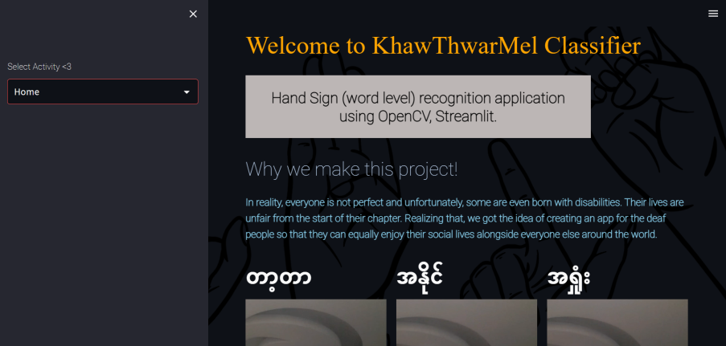
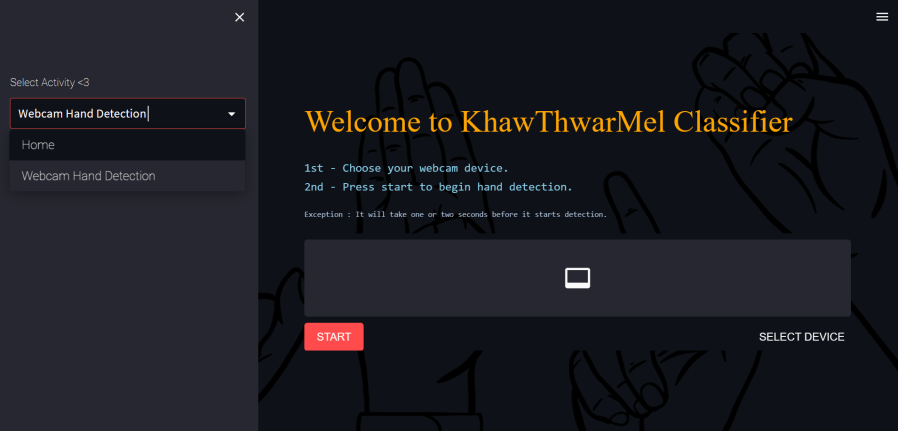
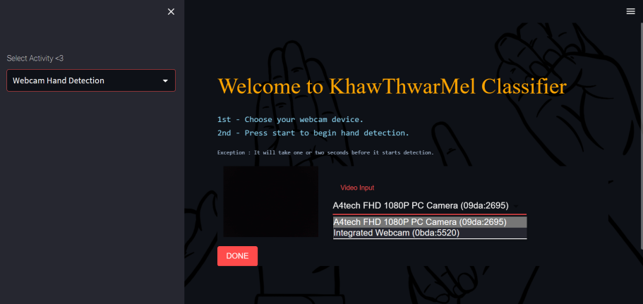

# Project Title

Myanmar Sign Language Recognition Application (Word Level).

## Description

Instances of discrimination against disabled individuals are prevalent worldwide. In various facets of life, such as careers or social activities, disabled people encounter unfairness. Among them, deaf people face significant difficulties, as most individuals lack awareness of how to communicate or learn sign language to interact with them. As a result, our team aimed to take the first step in bridging the gap between deaf and non-deaf individuals by developing a platform that facilitates understanding of sign language, enabling communication at one's fingertips. Therefore, we created an AI model that can detect sign language using webcams and mobile phone cameras. Our primary objectives are as follows:

- To translate Myanmar Sign Language at the word level.
- To provide the first applicable use of Myanmar Sign Language detection.
- To lead the ongoing research on this project.

Our team comprises four passionate youths from a technology background who aim to support the disabled community in Myanmar.

## Getting Started

### Dependencies

OS Version - Window 10/11
<br>
Required Libraries: <a href="https://github.com/Mooncak3e/BSLR_3Words/blob/main/requirements.txt">requirements.txt</a>                    
Virtual Environment - Anaconda (ver - 23.1.0)
<br>
Python Version - 3.9.16

### Installing

We don't need any prior installation methods as we used <a href="https://streamlit.io/">Streamlit</a> platform.

### Executing program

(How to run the program)
* Open Anaconda Prompt
* Open your virtual environment by using this command.
```
conda activate environment_name
```
* Open the application by using this command. 
```
streamlit run project_name.py
```

(After running the program)
* A browser will pop up that will lead to our "Home Page" of the program. 


* Choose "Webcam Hand Detection" to run Sign Language Recognition Module. 


* Select the Webcam Device to detect signs.
 

* After selecting device you can simply start to detect Hand Signs by pressing "Start" button.

## Authors

Contributors 
- Bhone Myint Swe
- Kaung Khant Min
- Kyaw
- Nain Aung Lu

## Version History

Version 1.0.0 - First Release
Initial release of the project
All core functionalities implemented
Comprehensive testing completed
As the first version of our project, version 1.0.0 marks a major milestone in our development process. This release includes all core functionalities and has undergone comprehensive testing to ensure its reliability and stability. We look forward to continuing to improve and refine the project in future releases.
